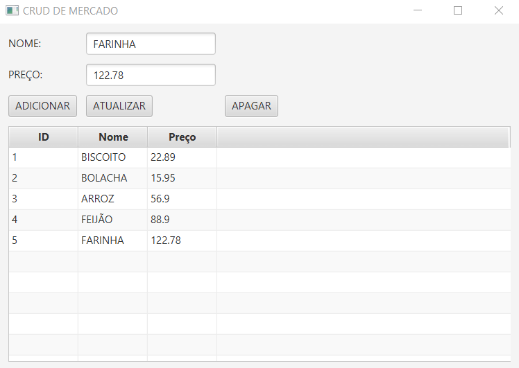
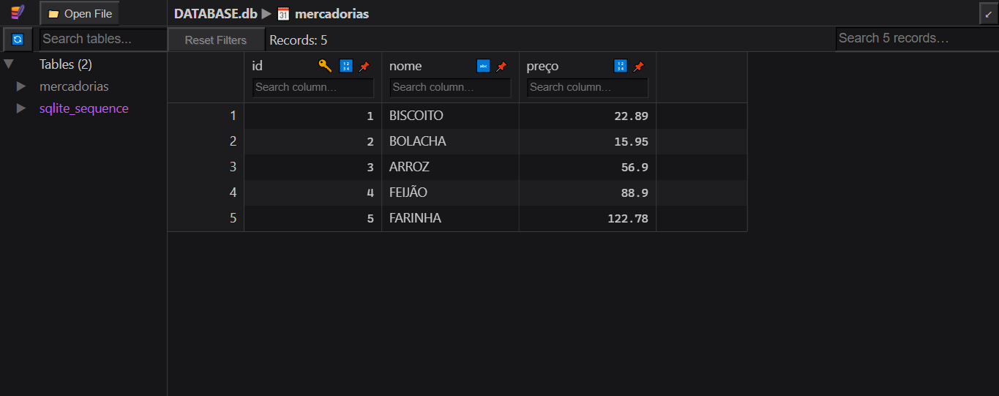

# CRUD DE MERCADO 
👨‍🏫CRUD DE NOME E PREÇO DOS PRODUTOS COM JAVAFX E SQLITE.

 <br>
 <br>

## DESCRIÇÃO:
Este projeto é uma aplicação de CRUD (Create, Read, Update, Delete) utilizando **JavaFX** para a interface gráfica e **SQLite** como banco de dados. O sistema gerencia um cadastro de produtos (mercadorias), permitindo que o usuário realize as operações de:

1. **Adicionar** um novo produto;
2. **Atualizar** as informações de um produto existente;
3. **Deletar** um produto;
4. **Listar** todos os produtos cadastrados na tabela.

## FUNCIONALIDADES:
1. **Tela Principal**:
   - A aplicação apresenta uma interface com:
     - Uma `TableView` mostrando os produtos cadastrados no banco.
     - Campos de entrada para `Nome` e `Preço` de um produto.
     - Botões para `Adicionar`, `Atualizar` e `Deletar` produtos.
   
2. **Ações**:
   - **Adicionar Produto**: O usuário preenche os campos e clica no botão "Adicionar". O produto é inserido no banco de dados e a tabela de produtos é atualizada.
   - **Atualizar Produto**: O usuário seleciona um produto na tabela, edita os campos de texto, e clica em "Atualizar". O produto selecionado no banco de dados é atualizado com as novas informações.
   - **Deletar Produto**: O usuário seleciona um produto na tabela e clica em "Deletar", removendo o produto do banco de dados.

3. **Banco de Dados SQLite**:
   - Ao iniciar o aplicativo, a tabela `mercadorias` é verificada e criada em `./CODIGO`. Cada operação de CRUD reflete diretamente no banco de dados SQLite, onde os produtos são armazenados.

## EXECUTANDO O PROJETO:
1. **Certifique-se de que o projeto esteja compilado:**
   Antes de executar o projeto, você deve garantir que ele foi compilado corretamente. Navegue até o diretório `./CODIGO`, e use o seguinte comando para compilar:

   ```bash
   mvn clean install
   ```

2. **Executar o projeto:**
   Para executar a aplicação com o Maven, usando a classe principal definida no seu `pom.xml`, use o comando:

   ```bash
   mvn javafx:run
   ```

3. **Operações CRUD**:
   - **Adicionar Produto**: Preencha o nome e o preço do produto e clique no botão "ADICIONAR". O produto será inserido na tabela de produtos.
   - **Atualizar Produto**: Clique em um produto da tabela para selecioná-lo. Após editar os campos de nome e preço, clique em "ATUALIZAR" para atualizar o produto no banco de dados.
   - **Deletar Produto**: Selecione um produto na tabela e clique em "APAGAR" para removê-lo do banco de dados.
   
4. **Visualização**:
   - Todos os produtos cadastrados serão exibidos na `TableView`, com as colunas para `ID`, `Nome` e `Preço` em `./CODIGO/DATABASE.db`.

## TECNOLOGIAS USADAS:
- [LINGUAGEM JAVA:](https://github.com/VILHALVA/CURSO-DE-JAVA) A linguagem de programação Java é amplamente utilizada para o desenvolvimento de aplicativos devido à sua portabilidade, segurança e robustez. Ela é uma escolha popular para desenvolver aplicativos desktop, web e móveis.

- [JAVAFX:](https://github.com/VILHALVA/CURSO-DE-JAVAFX) JavaFX é uma Bíblioteca (plataforma) de desenvolvimento rica para criar aplicações gráficas (GUI) modernas e sofisticadas em Java. Ele é projetado para substituir o Swing como a principal biblioteca para GUIs no Java. JavaFX oferece uma ampla gama de recursos que tornam o desenvolvimento mais intuitivo, flexível e visualmente atraente. 

- [SQLITE:](https://github.com/VILHALVA/CURSO-DE-SQLITE) **SQLite** é um sistema de gerenciamento de banco de dados relacional (RDBMS) que se destaca por ser "self-contained", "serverless", "zero-configuration" e por ocupar um espaço mínimo em disco. Desenvolvido por D. Richard Hipp em 2000, o SQLite foi projetado para ser embutido diretamente em programas em vez de funcionar como um serviço separado, como muitos outros sistemas de banco de dados. 

## CREDITOS:
- [PROJETO BASEADO NO "CRUD COM JAVAFX"](https://github.com/VILHALVA/CRUD-COM-JAVAFX)
- [PROJETO FEITO PELO VILHALVA](https://github.com/VILHALVA)


